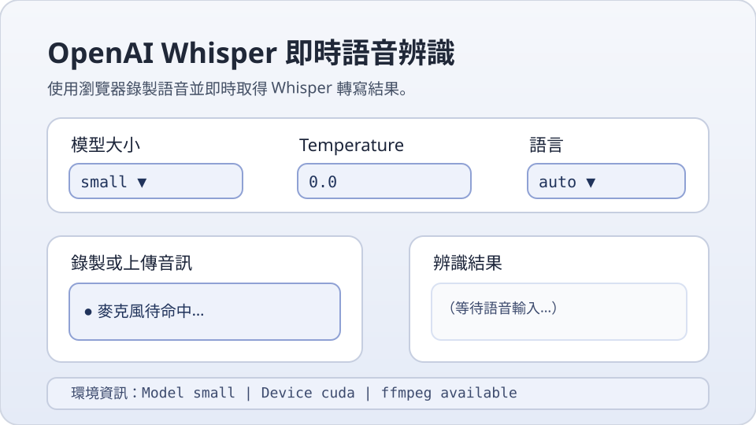

# OpenAI Whisper ASR WebUI

這個專案提供一個即時語音辨識（ASR）Web 介面，使用者可以透過瀏覽器的麥克風錄音，並由 OpenAI Whisper 模型即時轉換成文字。預設會自動下載並載入較小的 `small` 模型，在 CPU/GPU 資源有限的環境下也能運作，並提供 Docker 容器化部署範例。



> **提示**：`docs/webui-preview.svg` 為以向量圖快速描繪的介面示意圖，方便在程式碼檢視或 PR 審查系統中預覽。若您能取得實際截圖，可替換成自己的圖片或外部連結。

## 功能特色

- 🌐 **瀏覽器 WebUI**：採用 [Gradio](https://gradio.app/) 建構，直接在瀏覽器中錄音與查看辨識結果。
- 🧠 **自動下載模型**：預設載入 `small` 模型，若本地尚未下載會自動取得。可在介面中切換 `tiny/base/small/medium/large-v2` 等模型。
- 🖥️ **自動偵測運算裝置**：自動判斷 `cuda`、`mps` 或 `cpu`，並盡可能啟用 FP16 加速。
- 🎙️ **麥克風偵測**：啟動時列出容器內可用的錄音裝置，協助確認硬體是否正確掛載。
- 🐳 **Docker 化部署**：提供 Dockerfile 與執行指令，方便快速佈署。
- 🧰 **命令列工具**：保留命令列模式，可對指定音訊檔案進行離線轉寫。

## 系統需求

- Python 3.9 以上。
- [ffmpeg](https://ffmpeg.org/)（Whisper 需要此工具處理多種音訊格式）。
- CPU 或 GPU（NVIDIA CUDA / Apple MPS）。若系統沒有 GPU 仍可使用 CPU 進行轉寫。
- 建議記憶體：
  - `tiny/base`：>= 4 GB RAM。
  - `small`：>= 6 GB RAM。
  - `medium` 以上：建議有 GPU 與 >= 12 GB RAM。

## 安裝步驟

1. 安裝系統依賴：

   ```bash
   sudo apt-get update && sudo apt-get install -y ffmpeg
   ```

2. 建立虛擬環境並安裝 Python 套件：

   ```bash
   python -m venv .venv
   source .venv/bin/activate
   pip install --upgrade pip
   pip install -r requirements.txt
   ```

## 啟動 WebUI

```bash
python -m openai_whisper_asr.webui
```

執行後會開啟本地端的 Gradio 介面，在瀏覽器中錄音即可看到即時辨識結果。首次啟動時會自動下載所選模型（預設 `small`）。

## 命令列使用方式

```bash
python -m openai_whisper_asr.cli ./samples/demo.wav --model small --language zh
```

命令列模式適合批次處理音訊檔，支援自訂模型大小、語言、溫度參數與模型下載位置。

## Docker 部署

1. 建構映像：

   ```bash
   docker build -t whisper-webui .
   ```

2. 以互動方式啟動容器並掛載麥克風裝置（依系統不同調整 `--device` 參數）：

   ```bash
   docker run --rm -p 7860:7860 \
     --device /dev/snd \
     whisper-webui
   ```

   若在 Mac/Windows 上使用 Docker Desktop，請在 Docker 設定中開啟麥克風授權或使用瀏覽器側錄音權限。

啟動後可透過 `http://localhost:7860` 存取 Web 介面。

## 麥克風偵測

WebUI 會透過 `sounddevice` 嘗試列出容器內的麥克風。若未顯示任何裝置，請確認：

- 容器或主機是否允許錄音裝置存取。
- 是否已安裝 ALSA/PortAudio 驅動程式。
- 在 Docker 中可透過掛載 `/dev/snd` 或 PulseAudio socket 提供音訊裝置。

## 常見問題

### 建立 PR 時出現「不支援二進位數據」

- 某些審查系統（例如自動化程式碼審查或 ChatGPT 代理）無法直接處理二進位檔案的 diff，因此會在建立 PR 時出現上述訊息。
- 本專案提供的介面示意圖改以 SVG（純文字格式）呈現，避免受限於二進位檔案；若您需要提交實際的 PNG/JPEG 截圖，可改採外部連結或使用 Git LFS 等適合的檔案託管方式。
- 若已經有二進位檔案在變更中，建議在提交前移除或改用文字化資源，再重新建立 PR。

## 專案結構

```
openai_whisper_ASR/
├── Dockerfile
├── README.md
├── requirements.txt
└── openai_whisper_asr/
    ├── __init__.py
    ├── cli.py
    ├── service.py
    └── webui.py
```

## 參考資源

- [OpenAI Whisper 官方專案](https://github.com/openai/whisper)
- [Gradio 官方文件](https://gradio.app/docs/)

歡迎提交 Issue 或 Pull Request 來改進本專案！
